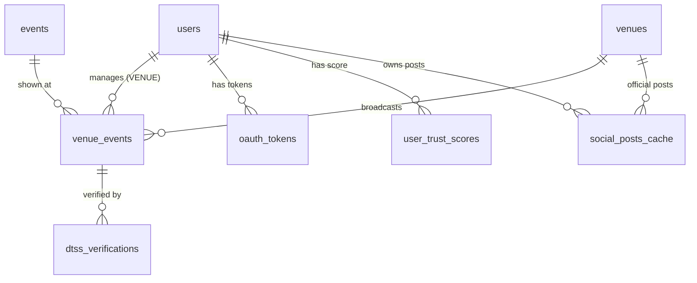

# Mosport Database Setup Guide

## Overview
資料庫採用 **Neon (Serverless PostgreSQL)** 部署於 **AWS ap-southeast-1 (新加坡)**，遵循三層分離架構。

---

## Architecture

### 🔥 Hot Zone
存放公開基礎資料：
- `users` - 用戶基本資料
- `venues` - 場館資訊
- `events` - 賽事資訊
- `venue_events` - 場館賽事配對

### 🔐 Vault
存放加密敏感資料：
- `oauth_tokens` - OAuth tokens (AES-256-GCM)

> **注意：** 生產環境需啟用 `pgcrypto` extension 進行 field-level encryption

### 🗑️ Dump
暫存社交資料（自動清理）：
- `social_posts_cache` - 社交貼文快取（24-48hr TTL）
- `ON DELETE CASCADE` 自動遵循隱私合規

---

## Setup Steps

### 1. 建立 Neon 專案

1. 訪問 [neon.tech](https://neon.tech)
2. 建立新專案，選擇 **AWS ap-southeast-1 (Singapore)**
3. 複製 Connection String：
   ```
   postgresql://[user]:[password]@[host]/[dbname]?sslmode=require
   ```

### 2. 設定環境變數

在專案根目錄的 `.env` 加入：

```bash
# Database (Neon PostgreSQL)
DATABASE_URL=postgresql://[user]:[password]@[host]/[dbname]?sslmode=require
```

### 3. 執行 Migration

使用 `psql` 或 Neon SQL Editor：

```bash
# 執行 Schema
psql $DATABASE_URL -f database/schema.sql

# 執行範例資料（開發環境）
psql $DATABASE_URL -f database/seed.sql
```

或使用 Neon Web Console 直接貼上 SQL 執行。

### 4. 驗證資料

```sql
-- 檢查 Tables
SELECT table_name FROM information_schema.tables 
WHERE table_schema = 'public';

-- 檢查範例資料
SELECT * FROM venues LIMIT 5;
SELECT * FROM events LIMIT 5;
```

---

## Data Model Relationships



---

## Common Queries

### 取得特定城市的場館與賽事

```sql
SELECT 
  v.name AS venue_name,
  e.title AS event_title,
  e.start_time,
  ve.verification_status
FROM venue_events ve
JOIN venues v ON ve.venue_id = v.id
JOIN events e ON ve.event_id = e.id
WHERE v.city = 'Ha Noi'
  AND e.start_time > NOW()
ORDER BY e.start_time;
```

### 計算場館 QoE Score

```sql
UPDATE venues
SET qoe_score = (
  SELECT AVG(
    CASE 
      WHEN verification_status = 'authority' THEN 10
      WHEN verification_status = 'confirmed' THEN 7
      ELSE 4
    END
  )
  FROM venue_events
  WHERE venue_id = venues.id
)
WHERE id = '660e8400-e29b-41d4-a716-446655440001';
```

---

## Maintenance

### 清理過期社交快取

```sql
-- 手動執行
SELECT cleanup_expired_social_cache();

-- 或設定 Neon Cron Job（需要 pg_cron extension）
SELECT cron.schedule('cleanup-social-cache', '0 */6 * * *', $$
  SELECT cleanup_expired_social_cache();
$$);
```

### 備份策略

Neon 提供自動備份，手動備份：

```bash
pg_dump $DATABASE_URL > backup_$(date +%Y%m%d).sql
```

---

## Security Notes

- ✅ 所有 OAuth tokens 需加密儲存（生產環境）
- ✅ 使用 Row-Level Security (RLS) 限制資料存取
- ✅ 定期輪換資料庫密碼
- ✅ 啟用 SSL/TLS 連線（Neon 預設）

---

**Last Updated:** 2026-01-21  
**Schema Version:** 1.0.0
